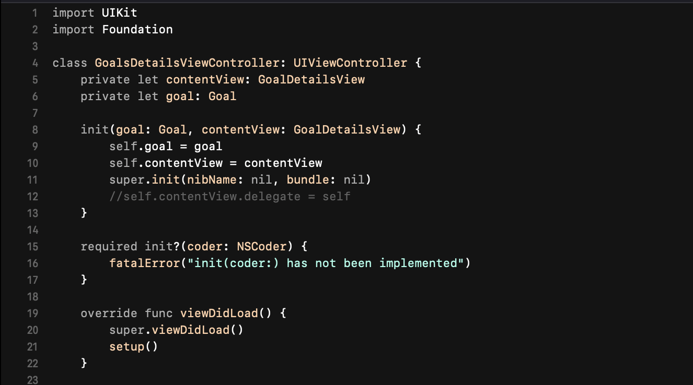

# Vesper Theme for Xcode

> **Peppermint and orange flavored dark theme for Xcode**

A beautiful port of the popular [Vesper theme](https://github.com/raunofreiberg/vesper) by [Rauno Freiberg](https://github.com/raunofreiberg), brought to Xcode with love.



## About

This is an Xcode port of the original **Vesper** theme created by [Rauno Freiberg](https://rauno.me/) for VS Code. The original theme is described as *"Peppermint and orange flavored dark theme"* and has become a favorite among developers for its elegant color palette and excellent readability.

**Original Vesper:**
- 🔗 [GitHub Repository](https://github.com/raunofreiberg/vesper)
- 👨‍💻 [Author's Website](https://rauno.me/)
- 📦 [VS Code Marketplace](https://marketplace.visualstudio.com/items?itemName=raunofreiberg.vesper)

## 🎨 Color Palette

| Element | Color | Hex | Usage |
|---------|-------|-----|--------|
| Background |  | `#101010` | Editor background |
| Foreground |  | `#FFFFFF` | Normal text, variables |
| Orange |  | `#FFC799` | Functions, classes, numbers |
| Green |  | `#99FFE4` | Strings, characters |
| Gray |  | `#A0A0A0` | Keywords, operators |
| Red |  | `#FF8080` | Errors, warnings |
| Comments |  | `#8B8B8B` | Comments (semi-transparent) |

## 🚀 Installation

### Automatic Installation (Recommended)

```bash
# Clone the repository
git clone https://github.com/diogotl/vesper-xcode-theme.git
cd vesper-xcode-theme

# Make the installer executable and run it
chmod +x install.sh
./install.sh

# Make the uninstaller executable and run it
chmod +x uninstall.sh
./uninstall.sh
